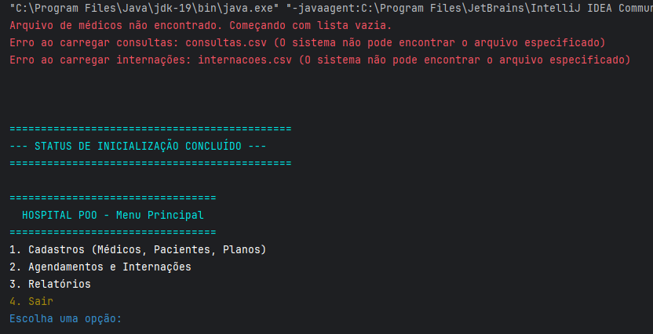

# 🏥 Trabalho Prático – Sistema de Gerenciamento Hospitalar  

## Descrição do Projeto

O Sistema de Gerenciamento Hospitalar foi desenvolvido em Java como o Projeto Final da disciplina de Orientação a Objetos (UnB FCTE). Este trabalho consiste na aplicação prática e completa dos pilares da POO para modelar um ambiente de saúde funcional. A solução utiliza Herança, Polimorfismo e Encapsulamento para gerenciar o workflow e garante a persistência de dados complexos em arquivos no formato CSV
## Dados do Aluno

- **Nome completo:** Vinicius Silva Araruna
- **Matrícula:** 242005089
- **Curso:** Engenharias
- **Turma:** 02

---

## Instruções para Compilação e Execução

1. **Compilação:**  
   Para compilar o projeto, execute o comando abaixo a partir da pasta raiz (`ep1-2025.2-ViniciusAraruna`):
    ```bash
   javac -d bin $(find src -name "*.java")
   ```
   ou:
    Para compilar o projeto utilizando uma IDE para execução, deve selecionar o url do github. Dessa forma,
    clonando o repositório, e encaminhando para sua IDE. (recomendado)

2. **Execução:**  
   ```bash
   java -cp bin main
   ```
   ou: Depois de clonar o repositório na sua IDE de preferência, procure pela classe main, executando-a.

3. **Estrutura de Pastas:**  
```
   ep1-2025.2-ViniciusAraruna [POO-java]/
├── .idea/
├── out/
├── src/
│   ├── Controlador/     
│   │   └── MenuPrincipal.java
│   │
│   ├── entidades/        
│   │   ├── consulta/
│   │   │   └── Consulta.java
│   │   ├── internacao/
│   │   │   └── Internacao.java
│   │   ├── pessoa/
│   │   │   ├── Medico.java
│   │   │   ├── Paciente.java
│   │   │   └── PacienteEspecial.java
│   │   ├── plano/
│   │   │   └── PlanoSaude.java
│   │   └── Pessoa.java
│   │
│   ├── Relatorios/       
│   │   └── RelatoriosServico.java
│   │
│   ├── repositorio/      
│   │   ├── ConsultaRepositorio.java
│   │   ├── InternacaoRepositorio.java
│   │   ├── MedicoRepositorio.java
│   │   ├── PacienteRepositorio.java
│   │   └── PlanoSaudeRepositorio.java
│   │
│   └── Servicos/         
│       ├── ConsultaServico.java
│       ├── InternacaoServico.java
│       ├── MedicoServico.java
│       ├── PacienteServico.java
│       └── PlanoSaudeServico.java
│
├── .gitignore
├── main.java             
└── POO-java.iml
```

3. **Versão do JAVA utilizada:**  
   java 19.0.2

---

## Vídeo de Demonstração

https://drive.google.com/drive/folders/1FkJoTGxHXFaEl3rDRLp1qOVF66e2jSwp?hl=pt-br

---

## Prints da Execução

1. Menu Principal:  
   

2. Cadastro de Médico:  
   

3. Relatório de Pacientes:  
   

---

---

## Observações (Extras ou Dificuldades)

A realização deste projeto foi extremamente satisfatória, pois alinha-se diretamente aos meus objetivos de trabalhar com desenvolvimento de apps e sistemas, estabelecendo uma direção clara para minha jornada como desenvolvedor. A transição da sintaxe do C para o Java facilitou o entendimento inicial, resultando em um grande aprendizado na aplicação da Programação Orientada a Objetos.
A maior dificuldade técnica residiu na implementação da persistência de dados. Inicialmente, o uso de arquivos .txt causava fácil corrupção. A solução final foi migrar para o formato CSV, onde a lógica de leitura e escrita foi blindada com codificação UTF-8 e rotinas defensivas (try-catch internos), garantindo a integridade dos dados e a persistência robusta do sistema
---

## Contato

vinicius.araruna18@gmail.com

---

